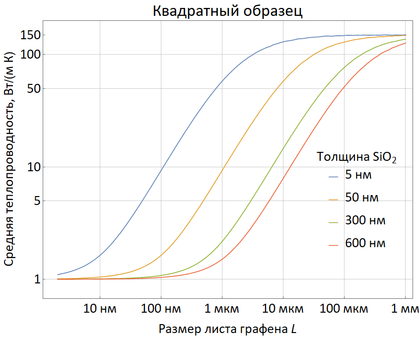
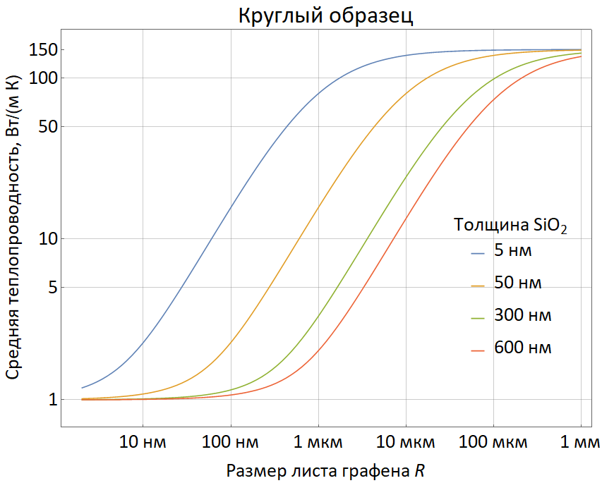

# К выводу уравнения теплопроводности «графен–контакты–подложка»

## Расчёт температуры подложки при заданном тепловыделении на поверхности

Расчёт температуры подложки Si/SiO$_2$ основан на решении уравнения теплопроводности:

$$-\nabla\bigl[\kappa(z)\,\nabla T\bigr] = 0,$$

при этом на верхней границе ставится условие известного тепловыделения

$$-\kappa(0)\,\frac{dT}{dz} = p(x,y),$$

мощность тепловыделения $p(x,y)$ (размерность Вт/м$^2$) для начала будем считать известной.

Для решения уравнения выполняется преобразование Фурье по координатам $x,\,y$ и переход к Фурье-образам:

$$T(\mathbf{q},z) = \int dx\,dy\;e^{-i\mathbf{q}\mathbf{r}_\parallel}\,T(\mathbf{r}_\parallel,z),\qquad p(\mathbf{q}) = \int dx\,dy\;e^{-i\mathbf{q}\mathbf{r}_\parallel}\,p(\mathbf{r}_\parallel),$$

уравнение теплопроводности становится обыкновенным дифференциальным

$$q^2\kappa(z)\,T(\mathbf{q},z) - \frac{d}{dz}\!\left[\kappa(z)\,\frac{dT(\mathbf{q},z)}{dz}\right] = 0,\qquad -\kappa(0)\,\frac{dT(\mathbf{q},z)}{dz}\bigg|_{z=0} = p(\mathbf{q}),$$

и решается с граничными условиями постоянства температуры и потока тепла на границах слоёв, если таковые имеются. Например, на границе Si/SiO$_2$, находящейся на расстоянии $z=-d$ от графена, имеем

$$T(\mathbf{q},z=-d_+) = T(\mathbf{q},z=-d_-),\qquad \kappa_1 T'(\mathbf{q},z=-d_+) = \kappa_2 T'(\mathbf{q},z=-d_-),$$

где $\kappa_1$ — теплопроводность верхнего слоя (SiO$_2$), $\kappa_2$ — теплопроводность нижнего слоя (Si). После решения температура графена $T(\mathbf{q},z=0)$ находится путём обратного преобразования Фурье. Если мы интересуемся средней температурой графена, то добавляется усреднение по площади листа.

Решение уравнения теплопроводности в Фурье-компонентах имеет вид

$$T(\mathbf{q},z=0) = \frac{p(\mathbf{q})}{|q|\kappa_1}\,\frac{\kappa_2\tanh(|q|d) + \kappa_1}{\kappa_1\tanh(|q|d) + \kappa_2}.$$

Легко проверить, что при $d=0$ теплопроводность первой среды (SiO$_2$) выпадает из ответа, а при $d\to\infty$ из ответа выпадает $\kappa_2$ (теплопроводность Si-подложки). Выполняя обратное преобразование Фурье, получим

$$T(\mathbf{r},z=0) = \int d\mathbf{r}'\,p(\mathbf{r}')\,g_T(\mathbf{r}-\mathbf{r}'),$$

$$g_T(\mathbf{r}-\mathbf{r}') = \int\frac{d\mathbf{q}}{(2\pi)^2}\,\frac{e^{i\mathbf{q}(\mathbf{r}-\mathbf{r}')}}{|q|\kappa_1}\,\frac{\kappa_2\tanh(|q|d) + \kappa_1}{\kappa_1\tanh(|q|d) + \kappa_2}.$$

## Связь тепловыделения на поверхности подложки и температуры графена

До сих пор мы искали температуру на верхней поверхности пластины, предполагая известный приток тепла из графена $p(\mathbf{r}')$. Учтём теперь, что температура самого графена $T_{2d}(\mathbf{r})$ может отличаться от температуры верхней кромки пластины $T(\mathbf{r},z=0)$ из-за сопротивления Капицы. Уравнение *поверхностной* теплопроводности на $T_{2d}(\mathbf{r})$ будет иметь вид

$$-\nabla\bigl[\sigma_{2d}(\mathbf{r})\,\nabla T_{2d}(\mathbf{r})\bigr] = p_{em}(\mathbf{r}) - p(\mathbf{r}),$$

где $p(\mathbf{r})$ отвечает за отток тепла из графена в подложку, $p_{em}(\mathbf{r})$ — тепловыделение в графене благодаря электромагнитному поглощению, $\sigma_{2d}(\mathbf{r})$ — распределение поверхностной теплопроводности графена (фактически, в это распределение можно внести и теплопроводность металлических контактов). Мы специально обозначили двумерную теплопроводность символом, отличным от подложки, чтобы подчеркнуть иную размерность: Вт/К для двумерной величины и Вт/(м·К) для объёмной. Отток тепла в подложку подчиняется линейному закону, коэффициент пропорциональности которого есть кондактанс Капицы $G_K$:

$$p(\mathbf{r}) = G_K(\mathbf{r})\bigl[T_{2d}(\mathbf{r}) - T(\mathbf{r},z=0)\bigr].$$

В итоге получаем сцеплённые уравнения на температуру графена и верхней кромки подложки:

$$\begin{cases}
-\nabla\bigl[\sigma_{2d}(\mathbf{r})\,\nabla T_{2d}(\mathbf{r})\bigr] = p_{em}(\mathbf{r}) - G_K(\mathbf{r})\bigl[T_{2d}(\mathbf{r}) - T(\mathbf{r},z=0)\bigr],\\[4pt]
T(\mathbf{r},z=0) = \displaystyle\int d\mathbf{r}'\,G_K(\mathbf{r}')\,g_T(\mathbf{r}-\mathbf{r}')\bigl[T_{2d}(\mathbf{r}') - T(\mathbf{r}',z=0)\bigr].
\end{cases}$$

Дальнейшее упрощение возможно в двух случаях:

(а) Свойства двумерной системы не зависят от координаты $\mathbf{r}$. Тогда снова решается методом преобразования Фурье в плоскости. Мы не будем на этом останавливаться.

(б) Кондактанс Капицы является самой большой величиной, тогда различием температуры графена и верхней кромки подложки можно пренебречь, $T_{2d}(\mathbf{r}) \approx T(\mathbf{r},z=0)$. Это приводит нас к упрощённому уравнению:

$$T_{2d}(\mathbf{r}) = \int d\mathbf{r}'\,g_T(\mathbf{r}-\mathbf{r}')\Bigl[p_{em}(\mathbf{r}') + \nabla\bigl[\sigma_{2d}(\mathbf{r}')\,\nabla T_{2d}(\mathbf{r}')\bigr]\Bigr].$$

## Числовые оценки и предельные случаи

Получим теперь некоторые численные оценки, чтобы понять, какие из каналов утечки тепла являются важными. Пусть образец графена имеет характерный размер $R$ и в нём выделяется полная мощность $P$. Баланс подвода и вывода тепла через подложку имеет вид

$$P = \pi R^2\,\kappa_{sub}\,\frac{dT}{dr} \approx \pi R^2\,\kappa_{sub}\,\frac{T_{2d}-T_0}{R},$$

тогда тепловое сопротивление подложки имеет порядок

$$Z_{T,sub} \sim \frac{1}{\pi R\,\kappa_{sub}}.$$

Точный расчёт методом Фурье, обозначенным выше, даёт

$$Z_{T,sub} = \frac{8}{3\pi^2\,R\,\kappa_{sub}}.$$

Взяв $\kappa_{sub} = 150$ Вт/(м·К) для кремния, $R = 30$ мкм — типичный радиус пятна в ИК экспериментах, получим

$$Z_{T,\,\mathrm{Si\,sub}} = 60 \text{ К/Вт}.$$

Если же взять теплопроводность оксида кремния в качестве теплопроводности подложки, то результат будет примерно в 100…150 раз выше:

$$Z_{T,\,\mathrm{SiO}_2\,\mathrm{sub}} = 6000\ldots 9000 \text{ К/Вт}.$$

В реальности теплопроводность композитной подложки получается усреднением выражения по волновым векторам. Результат имеет вид

$$\frac{1}{\langle\kappa\rangle} = \frac{3\pi}{8}\,\frac{1}{\kappa_1}\int_{-\infty}^{+\infty}\frac{d\tau}{2}\left(\frac{2J_1(\tau)}{\tau}\right)^{\!2}\,\frac{\kappa_1 + \kappa_2\tanh(\tau d/R)}{\kappa_2 + \kappa_1\tanh(\tau d/R)}.$$

В работе [K. F. Mak, C. H. Lui, and T. F. Heinz, "Measurement of the thermal conductance of the graphene/SiO2 interface," *Appl. Phys. Lett.*, vol. 97, no. 22, Nov. 2010, doi: 10.1063/1.3511537] измерен кондактанс Капицы «графен–SiO$_2$», который оказался равен $G_K = 5\times 10^7$ Вт/(м$^2$·К). Тепловое сопротивление Капицы для кругового образца радиуса $R = 30$ мкм получится

$$Z_K = \frac{1}{\pi R^2\,G_K} = 7 \text{ К/Вт},$$

что значительно меньше теплового сопротивления подложки. Это оправдывает наше предположение о равенстве температуры графена и верхней кромки подложки. Соотношение может нарушаться при низких температурах, когда $G_K$ сильно падает. Также при меньших значениях радиуса пятна (уже около 5 мкм) $Z_K$ и $Z_{T,sub}$ могут стать сравнимыми.

Наконец, оценим вклад металлических контактов $Z_{met}$ в тепловое сопротивление. Окружим мысленно графен круговым металлическим контактом со внутренним радиусом $R = 30$ мкм и внешним радиусом $R_{max}\gg R$. Задача об утечке тепла по поверхности металлического контакта эквивалентна задаче о сопротивлении диска Корбино. Результат имеет вид

$$Z_{met} = \frac{\ln(R_{max}/R)}{2\pi\,\kappa_{met}\,t_{met}},$$

где $t_{met}$ — толщина контакта в вертикальном направлении. Взяв $R_{max} = 1$ мм, $\kappa_{met} = 300$ Вт/(м·К), $t_{met} = 200$ нм, получим оценку

$$Z_{met} \approx 9\times 10^3 \text{ К/Вт}.$$

Тепловое сопротивление металлических контактов очень велико, а теплопроводностью по ним с хорошей точностью можно пренебречь, в сравнении с теплопроводностью подложки. Это связано, в конечном счёте, с малой толщиной контактов $t_{met}\ll R$. Пренебрежение становится менее оправданным, если слой SiO$_2$ толстый — тогда теплопроводность подложки и контактов становятся близкими величинами. В любом случае, теплопроводностью графена можно пренебрегать уверенно, т.к. она много меньше, чем у металлов.

Таким образом, выстраивается следующая иерархия приближений для расчёта температуры графена при облучении:

1. В наиболее простом случае пренебрегаем сопротивлением Капицы и теплопроводностью по металлам и самому графену. Уравнение для определения температуры поверхности имеет вид

   $$T_{2d}(\mathbf{r}) = \int d\mathbf{r}'\,g_T(\mathbf{r}-\mathbf{r}')\,p_{em}(\mathbf{r}').$$

   Оно даже не имеет вид уравнения — это законченное равенство для определения температуры поверхности по известной электромагнитной мощности.

2. Для сильно изолирующих подложек (например, при наличии толстого слоя SiO$_2$ порядка 1 мкм) или для толстых металлических контактов (порядка 1 мкм) стоит учесть теплопроводность по контактам и решить интегральное уравнение

   $$T_{2d}(\mathbf{r}) = \int d\mathbf{r}'\,g_T(\mathbf{r}-\mathbf{r}')\Bigl[p_{em}(\mathbf{r}') + \nabla\bigl[\sigma_{2d}(\mathbf{r}')\,\nabla T_{2d}(\mathbf{r}')\bigr]\Bigr].$$

3. Для криогенных температур или сверхмалых образцов необходимо учитывать конечное сопротивление Капицы и решать систему

   $$\begin{cases}
   -\nabla\bigl[\sigma_{2d}(\mathbf{r})\,\nabla T_{2d}(\mathbf{r})\bigr] = p_{em}(\mathbf{r}) - G_K(\mathbf{r})\bigl[T_{2d}(\mathbf{r}) - T(\mathbf{r},z=0)\bigr],\\[4pt]
   T(\mathbf{r},z=0) = \displaystyle\int d\mathbf{r}'\,G_K(\mathbf{r}')\,g_T(\mathbf{r}-\mathbf{r}')\bigl[T_{2d}(\mathbf{r}') - T(\mathbf{r}',z=0)\bigr].
   \end{cases}$$

   Роль подложки при этом будет не так велика, как роль теплопроводности по поверхности.

4. В случае ультранизких температур (сильное развязывание электронов от подложки) можно вообще считать подложку находящейся при температуре окружения, тогда

   $$-\nabla\bigl[\sigma_{2d}(\mathbf{r})\,\nabla T_{2d}(\mathbf{r})\bigr] = p_{em}(\mathbf{r}) - G_K(\mathbf{r})\,T_{2d}(\mathbf{r}).$$

## Особенности реализации для отдельных антенн и метаповерхностей

Функция Грина уравнения теплопроводности имеет несколько различный вид в случае отдельного детектора с антенной и детектора типа «периодическая метаповерхность».

Для отдельного детектора с антенной интегрирование ведётся по площади всех теплопроводящих элементов на поверхности, то есть металлов и графена

$$T_{2d}(\mathbf{r}) = \int_{\mathrm{Gr,Me}} d\mathbf{r}'\,g_T(\mathbf{r}-\mathbf{r}')\Bigl[p_{em}(\mathbf{r}') + \nabla\bigl[\sigma_{2d}(\mathbf{r}')\,\nabla T_{2d}(\mathbf{r}')\bigr]\Bigr],$$

$$\sigma_{2d}(\mathbf{r}') = \begin{cases} \sigma_{Gr}, & \mathbf{r}'\in\mathrm{Gr},\\ \kappa_{Me}\,t_{Me}, & \mathbf{r}'\in\mathrm{Me}.\end{cases}$$

Таким образом, интегральное уравнение решается на конечной области, и нет никаких проблем с постановкой гранусловий на бесконечности. Функция Грина имеет стандартный вид

$$g_T(\mathbf{r}-\mathbf{r}') = \int\frac{d\mathbf{q}}{(2\pi)^2}\,\frac{e^{i\mathbf{q}(\mathbf{r}-\mathbf{r}')}}{|q|\kappa_1}\,\frac{\kappa_2\tanh(|q|d) + \kappa_1}{\kappa_1\tanh(|q|d) + \kappa_2}.$$

В случае метаповерхности уравнение решается внутри элементарной ячейки

$$T_{2d}(\mathbf{r}) = \int_{\mathrm{Unit\,cell}} d\mathbf{r}'\,\tilde g_T(\mathbf{r}-\mathbf{r}')\Bigl[p_{em}(\mathbf{r}') + \nabla\bigl[\sigma_{2d}(\mathbf{r}')\,\nabla T_{2d}(\mathbf{r}')\bigr]\Bigr].$$

Однако функция Грина в этом случае даётся не интегралом Фурье, а рядом Фурье, с волновыми векторами кратными вектору обратной решётки:

$$\tilde g_T(\mathbf{r}-\mathbf{r}') = \frac{1}{L_x L_y}\sum_{n_x,n_y=-\infty}^{+\infty}\frac{e^{i\mathbf{q}(\mathbf{r}-\mathbf{r}')}}{|q|\kappa_1}\,\frac{\kappa_2\tanh(|q|d) + \kappa_1}{\kappa_1\tanh(|q|d) + \kappa_2},\qquad \mathbf{q} = \frac{2\pi n_x}{L_x}\mathbf{e}_x + \frac{2\pi n_y}{L_y}\mathbf{e}_y.$$

Здесь мы сталкиваемся с проблемой: когда оба индекса равны нулю $n_x = n_y = 0$, соответствующее слагаемое в сумме строго равно бесконечности. Это не случайно: нагрев бесконечной плоской структуры с постоянной плотностью мощности обязан привести к бесконечному повышению температуры. Однако мы интересуемся не самим общим ростом температуры, а скорее её градиентами внутри элементарной ячейки. Поэтому бесконечное слагаемое может быть отброшено, а функцию Грина стоит определить с отбрасыванием нуля

$$\tilde g_{T,\mathrm{reg}}(\mathbf{r}-\mathbf{r}') = \frac{1}{L_x L_y}\sum_{\substack{n_x,n_y=-\infty\\ n_x\,\cup\,n_y\neq 0}}^{+\infty}\frac{e^{i\mathbf{q}(\mathbf{r}-\mathbf{r}')}}{|q|\kappa_1}\,\frac{\kappa_2\tanh(|q|d) + \kappa_1}{\kappa_1\tanh(|q|d) + \kappa_2},\qquad \mathbf{q} = \frac{2\pi n_x}{L_x}\mathbf{e}_x + \frac{2\pi n_y}{L_y}\mathbf{e}_y.$$

Чтобы аккуратнее обосновать процедуру вычитания бесконечного слагаемого, рассмотрим метаповерхность, которая освещается лазерным пучком с интенсивностью, медленно спадающей от центра к краям. Для всей метаповерхности целиком (а не для отдельной её ячейки) верно «большое» уравнение

$$T_{2d}(\mathbf{r}) = \int_{\mathrm{metasurface}} d\mathbf{r}'\,g_T(\mathbf{r}-\mathbf{r}')\,q(\mathbf{r}').$$

Разобьём теперь сумму на элементарные ячейки

$$T_{2d}(\mathbf{r}) = \left(\int_{\mathrm{cell\,1}} + \int_{\mathrm{cell\,2}} + \ldots + \int_{\mathrm{cell\,N}}\right)\!\Bigl\{d\mathbf{r}'\,g_T(\mathbf{r}-\mathbf{r}')\,q(\mathbf{r}')\Bigr\}.$$

Сведём теперь интегрирование лишь к одной элементарной ячейке. Для этого заметим, что сдвиг радиус-вектора приводит к следующему изменению функции Грина:

$$g_T(\mathbf{r}-\mathbf{r}'+\mathbf{L}\times n) = \int\frac{d\mathbf{q}}{(2\pi)^2}\,g_T(\mathbf{q})\,e^{i\mathbf{q}(\mathbf{r}-\mathbf{r}'+\mathbf{L}\times n)},$$

иначе говоря, сдвиг функции в координатном пространстве умножает её Фурье-компоненты на фазовый множитель $e^{i\mathbf{q}\mathbf{L}\times n}$. Этот же сдвиг радиус-вектора приводит к почти периодическому повторению функции тепловыделения

$$q(\mathbf{r}+\mathbf{L}\times n) = q(\mathbf{r})\,\exp(-\gamma n).$$

Для идеально бесконечного лазерного пятна и бесконечной метаповерхности мы имеем строгую периодичность $\gamma = 0$. Для ограниченного же лазерного пятна $\gamma \ll 1$. Можно оценить $\gamma\sim L/R_{beam}$, где $L$ — размер ячейки метаповерхности, $R_{beam}$ — размер светового пятна. Подставляя периодические правила, получим

$$T_{2d}(\mathbf{r}) = \int_{\mathrm{cell\,1}} d\mathbf{r}'\,G_T(\mathbf{r}-\mathbf{r}')\,q(\mathbf{r}'),$$

$$G_T(\mathbf{r}-\mathbf{r}') = \sum_{n_x,n_y}\int\frac{d\mathbf{q}}{(2\pi)^2}\,e^{i\mathbf{q}(\mathbf{r}-\mathbf{r}')}\,g_T(\mathbf{q})\,\exp\bigl(iq_x n_x L_x - \gamma|n_x|\bigr)\,\exp\bigl(iq_y n_y L_y - \gamma|n_y|\bigr).$$

Вычислим дискретную сумму с помощью формулы

$$2\sum_{n=0}^{\infty}\cos(qnL)\,e^{-\gamma n} = 1 + \frac{\sinh\gamma}{\cosh\gamma - \cos qL},$$

и получим для функции Грина в метаповерхности

$$G_T(\mathbf{r}-\mathbf{r}') = \int\frac{d\mathbf{q}}{(2\pi)^2}\,g_T(\mathbf{q})\,e^{i\mathbf{q}(\mathbf{r}-\mathbf{r}')}\,\frac{\sinh\gamma}{\cosh\gamma - \cos q_x L_x}\cdot\frac{\sinh\gamma}{\cosh\gamma - \cos q_y L_y}.$$

В пределе $\gamma\ll 1$ каждый из множителей имеет узкий (дельта-образный) пик при $q_x L_x \approx 2\pi n_x$, $q_y L_y \approx 2\pi n_y$. При этом

$$\frac{\sinh\gamma}{\cosh\gamma - \cos q_x L_x} \approx \frac{2\gamma}{\gamma^2 + (q_x L_x - 2\pi n_x)^2} \approx 2\pi\,\delta(q_x L_x - 2\pi n_x).$$

Снимая $\mathbf{q}$-интегрирование с помощью дельта-функций, получим

$$G_T(\mathbf{r}-\mathbf{r}') = \frac{1}{L_x L_y}\sum_{n_x,n_y}g_T(\mathbf{q}_{n_x n_y})\,e^{i\mathbf{q}_{n_x n_y}(\mathbf{r}-\mathbf{r}')},\qquad \mathbf{q}_{n_x n_y} = \frac{2\pi n_x}{L_x}\mathbf{e}_x + \frac{2\pi n_y}{L_y}\mathbf{e}_y.$$

Однако дельта-функциональное приближение не работает при $n_x = n_y = 0$, так как $g_T(\mathbf{q})\approx (\kappa|\mathbf{q}|)^{-1}$ при $|\mathbf{q}|\to 0$. Зато регуляризованная формула даёт возможность вычислить вклад малых $|\mathbf{q}|$ в функцию Грина. Покажем это:

$$\begin{aligned}
\delta G_T(\mathbf{r}-\mathbf{r}') &= \int\frac{dq_x\,dq_y}{(2\pi)^2}\,\frac{1}{\kappa\sqrt{q_x^2 + q_y^2}}\,e^{i\mathbf{q}(\mathbf{r}-\mathbf{r}')}\,\frac{2\gamma}{\gamma^2 + (q_x L_x)^2}\,\frac{2\gamma}{\gamma^2 + (q_y L_y)^2} \\
&\approx \int\frac{dq_y}{(2\pi)^2}\,\frac{1}{\kappa}\,\frac{2\gamma}{\gamma^2 + (q_y L_y)^2}\,\frac{4\,\operatorname{arccosh}\!\bigl(\gamma/(q_y L_y)\bigr)}{\sqrt{\gamma^2 + (q_y L_y)^2}} \\
&= \frac{1}{L_y\gamma\kappa}\int_{-\infty}^{+\infty}\frac{dt}{(2\pi)^2}\,\frac{8\,\operatorname{arccosh}(1/t)}{1+t^2} \approx \frac{0.8}{L_y\kappa}.
\end{aligned}$$

Таким образом, мы получили, что бесконечная часть суммы — член с $n_x = n_y = 0$ — не имеет пространственной зависимости и является после регуляризации большой постоянной добавкой к функции Грина. Наличие такого слагаемого соответствует общему повышению температуры метаповерхности, но не влияет на градиенты и разности температур внутри элементарной ячейки.

## Средняя теплопроводность композитной подложки SiO$_2$/Si

Приведём результаты для средней температуры в случае квадратного (со стороной $L$) и круглого (с радиусом $R$) образцов, которые следуют для постоянной мощности.

Для круга:

$$p(\mathbf{r}) = \begin{cases} p_0, & r < R,\\ 0, & r > R.\end{cases}$$

Для квадрата:

$$p(\mathbf{r}) = \begin{cases} p_0, & |x| < L/2,\ |y| < L/2,\\ 0, & \text{otherwise}.\end{cases}$$

$$\langle T_\square\rangle = \frac{Lp_0}{\kappa_1}\int_{-\infty}^{+\infty}\frac{d\xi\,d\eta}{(2\pi)^2}\,\frac{1}{\sqrt{\xi^2+\eta^2}}\left(\frac{\sin\xi/2}{\xi/2}\right)^{\!2}\left(\frac{\sin\eta/2}{\eta/2}\right)^{\!2}\,\frac{\kappa_1 + \kappa_2\tanh\!\bigl(d\sqrt{\xi^2+\eta^2}/L\bigr)}{\kappa_2 + \kappa_1\tanh\!\bigl(d\sqrt{\xi^2+\eta^2}/L\bigr)},$$

$$\langle T_\circ\rangle = \frac{Rp_0}{\kappa_1}\int_{-\infty}^{+\infty}\frac{d\tau}{2}\left(\frac{2J_1(\tau)}{\tau}\right)^{\!2}\,\frac{\kappa_1 + \kappa_2\tanh(\tau d/R)}{\kappa_2 + \kappa_1\tanh(\tau d/R)}.$$

Введём теперь среднюю теплопроводность $\langle\kappa\rangle$ двухслойной подложки. Определим её так, чтобы решение уравнения для однослойной подложки со средней теплопроводностью совпадало с решением для настоящей двухслойной подложки. Получим для квадрата

$$\frac{1}{\langle\kappa\rangle_\square}\,J_\square = \frac{1}{\kappa_1}\int_{-\infty}^{+\infty}\frac{d\xi\,d\eta}{(2\pi)^2}\,\frac{1}{\sqrt{\xi^2+\eta^2}}\left(\frac{\sin\xi/2}{\xi/2}\right)^{\!2}\left(\frac{\sin\eta/2}{\eta/2}\right)^{\!2}\,\frac{\kappa_1 + \kappa_2\tanh\!\bigl(d\sqrt{\xi^2+\eta^2}/L\bigr)}{\kappa_2 + \kappa_1\tanh\!\bigl(d\sqrt{\xi^2+\eta^2}/L\bigr)},$$

$$J_\square = \int_{-\infty}^{+\infty}\frac{d\xi\,d\eta}{(2\pi)^2}\,\frac{1}{\sqrt{\xi^2+\eta^2}}\left(\frac{\sin\xi/2}{\xi/2}\right)^{\!2}\left(\frac{\sin\eta/2}{\eta/2}\right)^{\!2} \approx 0.47,$$

и для круга

$$\frac{J_\circ}{\langle\kappa_\circ\rangle} = \frac{1}{\kappa_1}\int_{-\infty}^{+\infty}\frac{d\tau}{2}\left(\frac{2J_1(\tau)}{\tau}\right)^{\!2}\,\frac{\kappa_1 + \kappa_2\tanh(\tau d/R)}{\kappa_2 + \kappa_1\tanh(\tau d/R)},$$

$$J_\circ = \int_{-\infty}^{+\infty}\frac{d\tau}{2}\left(\frac{2J_1(\tau)}{\tau}\right)^{\!2} = \frac{8}{3\pi}.$$

Построим получающиеся средние теплопроводности для SiO$_2$ реалистичной толщины — от 5 нм до 600 нм, и для разных размеров прибора. Теплопроводность кремния положим равной 150 Вт/(м·К), оксида кремния — 1 Вт/(м·К).

**(А)**

**(Б)**

*Рассчитанные значения средней теплопроводности композитной подложки Si/SiO2 при различной толщине SiO2 (показана цветами) и для различного размера графенового устройства. А — для квадратного образца, Б — для круглого.*

Рассчитанные зависимости имеют следующие свойства:

- они корректно интерполируют между теплопроводностью SiO$_2$ для маленьких приборов и теплопроводностью Si для больших приборов;
- когда размер прибора становится сравним с толщиной SiO$_2$, средняя теплопроводность всё ещё много меньше теплопроводности кремния по причине большого различия между теплопроводностями кремния и оксида;
- средняя теплопроводность становится порядка половины теплопроводности кремния при размере прибора порядка $(\kappa_2/\kappa_1)\,d \approx 150\,d$. Например, для оксида 300 нм и квадратного прибора с размером 100 мкм получаем среднюю теплопроводность 75 Вт/(м·К). То есть даже для большого прибора имеется ощутимое снижение средней теплопроводности благодаря оксиду.
